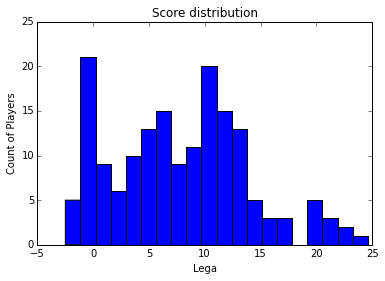

# Round 7

    import pandas as pd
    import numpy as np
    from prettytable import PrettyTable
    import matplotlib as plt
    from utils import to_int, best_by_role
    from IPython.display import HTML, display
    
    # !ls
    
    CSV_FILE_NAME = 'data/profiles_7.csv'
    CSV_FILE_OUT = 'data/myteam_7.csv'
    
    BUDGET = 100000
    
    # how to split the budget.
    bdg_part = (0.83, 0.25, 0.10) 

    df = pd.read_csv(CSV_FILE_NAME, sep=',')
    df.rename(columns={'+/-': 'Val'}, inplace=True)
    df.Val.fillna(0, inplace=True)
    # drop the Url -> is unuseful !!
    df.drop(['Url', 'Media'] , axis=1, inplace=True)

# Exploratory Data Analysis

    df.head()

<table border="1" class="dataframe">
  <thead>
    <tr style="text-align: right;">
      <th></th>
      <th>Name</th>
      <th>Team</th>
      <th>Role</th>
      <th>Age</th>
      <th>Country</th>
      <th>PR</th>
      <th>PG</th>
      <th>SF</th>
      <th>PT</th>
      <th>MIN</th>
      <th>...</th>
      <th>Tot</th>
      <th>Dat</th>
      <th>Sub</th>
      <th>Per</th>
      <th>Rec</th>
      <th>Ass</th>
      <th>Lega</th>
      <th>OER</th>
      <th>Adp</th>
      <th>Val</th>
    </tr>
  </thead>
  <tbody>
    <tr>
      <th>0</th>
      <td>  Basile Gianluca</td>
      <td>     Upea Capo d'Orlando</td>
      <td>     Guardia</td>
      <td> 40</td>
      <td>  ITA</td>
      <td>    </td>
      <td>    </td>
      <td>    </td>
      <td> 1.8 </td>
      <td> 23.0 </td>
      <td>...</td>
      <td> 1.5 </td>
      <td> 0.0 </td>
      <td> 0.2 </td>
      <td> 1.0 </td>
      <td> 1.2 </td>
      <td> 3.2 </td>
      <td>  0.7 </td>
      <td> 0.341 </td>
      <td> 3.3 </td>
      <td>  4.8 </td>
    </tr>
    <tr>
      <th>1</th>
      <td> Burgess Bradford</td>
      <td>     Upea Capo d'Orlando</td>
      <td>         Ala</td>
      <td> 24</td>
      <td>  USA</td>
      <td>    </td>
      <td>    </td>
      <td>    </td>
      <td> 8.7 </td>
      <td> 29.2 </td>
      <td>...</td>
      <td> 3.5 </td>
      <td> 0.0 </td>
      <td> 0.5 </td>
      <td> 1.5 </td>
      <td> 0.7 </td>
      <td> 1.5 </td>
      <td>  8.5 </td>
      <td> 0.891 </td>
      <td> 0.7 </td>
      <td> -4.0 </td>
    </tr>
    <tr>
      <th>2</th>
      <td>  Bozzetti Andrea</td>
      <td>          Vanoli Cremona</td>
      <td> Guardia/Ala</td>
      <td> 18</td>
      <td>  ITA</td>
      <td> NaN</td>
      <td> NaN</td>
      <td> NaN</td>
      <td>  NaN</td>
      <td>   NaN</td>
      <td>...</td>
      <td>  NaN</td>
      <td>  NaN</td>
      <td>  NaN</td>
      <td>  NaN</td>
      <td>  NaN</td>
      <td>  NaN</td>
      <td>   NaN</td>
      <td>    NaN</td>
      <td>  NaN</td>
      <td>     0</td>
    </tr>
    <tr>
      <th>3</th>
      <td>        Buva Ivan</td>
      <td> Acqua Vitasnella Cantù</td>
      <td>         Ala</td>
      <td> 23</td>
      <td>  CRO</td>
      <td>    </td>
      <td>    </td>
      <td>    </td>
      <td> 6.2 </td>
      <td> 18.2 </td>
      <td>...</td>
      <td>   5 </td>
      <td> 0.2 </td>
      <td> 0.3 </td>
      <td> 0.3 </td>
      <td> 0.3 </td>
      <td> 1.0 </td>
      <td> 10.3 </td>
      <td> 0.946 </td>
      <td> 1.0 </td>
      <td> -2.2 </td>
    </tr>
    <tr>
      <th>4</th>
      <td>     Campani Luca</td>
      <td>          Vanoli Cremona</td>
      <td>  Ala/Centro</td>
      <td> 25</td>
      <td>  ITA</td>
      <td>    </td>
      <td>    </td>
      <td>    </td>
      <td> 9.5 </td>
      <td> 25.2 </td>
      <td>...</td>
      <td> 3.9 </td>
      <td> 0.5 </td>
      <td> 0.3 </td>
      <td> 0.8 </td>
      <td> 0.5 </td>
      <td> 0.3 </td>
      <td> 11.8 </td>
      <td> 1.176 </td>
      <td> 0.0 </td>
      <td>  7.7 </td>
    </tr>
  </tbody>
</table>

5 rows × 34 columns

    df.describe()

<table border="1" class="dataframe">
  <thead>
    <tr style="text-align: right;">
      <th></th>
      <th>Age</th>
    </tr>
  </thead>
  <tbody>
    <tr>
      <th>count</th>
      <td> 224.000000</td>
    </tr>
    <tr>
      <th>mean</th>
      <td>  24.705357</td>
    </tr>
    <tr>
      <th>std</th>
      <td>   5.770092</td>
    </tr>
    <tr>
      <th>min</th>
      <td>   0.000000</td>
    </tr>
    <tr>
      <th>25%</th>
      <td>  20.750000</td>
    </tr>
    <tr>
      <th>50%</th>
      <td>  24.500000</td>
    </tr>
    <tr>
      <th>75%</th>
      <td>  28.000000</td>
    </tr>
    <tr>
      <th>max</th>
      <td>  48.000000</td>
    </tr>
  </tbody>
</table>

    pd.DataFrame(list(df.Team.unique()), columns=['Team'])

<table border="1" class="dataframe">
  <thead>
    <tr style="text-align: right;">
      <th></th>
      <th>Team</th>
    </tr>
  </thead>
  <tbody>
    <tr>
      <th>0 </th>
      <td>        Upea Capo d'Orlando</td>
    </tr>
    <tr>
      <th>1 </th>
      <td>             Vanoli Cremona</td>
    </tr>
    <tr>
      <th>2 </th>
      <td>    Acqua Vitasnella Cantù</td>
    </tr>
    <tr>
      <th>3 </th>
      <td>              Enel Brindisi</td>
    </tr>
    <tr>
      <th>4 </th>
      <td>        Openjobmetis Varese</td>
    </tr>
    <tr>
      <th>5 </th>
      <td>       Pasta Reggia Caserta</td>
    </tr>
    <tr>
      <th>6 </th>
      <td>    Dolomiti Energia Trento</td>
    </tr>
    <tr>
      <th>7 </th>
      <td>           Sidigas Avellino</td>
    </tr>
    <tr>
      <th>8 </th>
      <td>  Grissin Bon Reggio Emilia</td>
    </tr>
    <tr>
      <th>9 </th>
      <td>  Banco di Sardegna Sassari</td>
    </tr>
    <tr>
      <th>10</th>
      <td>                  Acea Roma</td>
    </tr>
    <tr>
      <th>11</th>
      <td>        Umana Reyer Venezia</td>
    </tr>
    <tr>
      <th>12</th>
      <td>          Granarolo Bologna</td>
    </tr>
    <tr>
      <th>13</th>
      <td>  EA7 Emporio Armani Milano</td>
    </tr>
    <tr>
      <th>14</th>
      <td>       Consultinvest Pesaro</td>
    </tr>
    <tr>
      <th>15</th>
      <td> Giorgio Tesi Group Pistoia</td>
    </tr>
    <tr>
      <th>16</th>
      <td>                        NaN</td>
    </tr>
  </tbody>
</table>

    pd.DataFrame(list(df.Role.unique()), columns=['Role'])

<table border="1" class="dataframe">
  <thead>
    <tr style="text-align: right;">
      <th></th>
      <th>Role</th>
    </tr>
  </thead>
  <tbody>
    <tr>
      <th>0</th>
      <td>      Guardia</td>
    </tr>
    <tr>
      <th>1</th>
      <td>          Ala</td>
    </tr>
    <tr>
      <th>2</th>
      <td>  Guardia/Ala</td>
    </tr>
    <tr>
      <th>3</th>
      <td>   Ala/Centro</td>
    </tr>
    <tr>
      <th>4</th>
      <td> Play/Guardia</td>
    </tr>
    <tr>
      <th>5</th>
      <td>       Centro</td>
    </tr>
    <tr>
      <th>6</th>
      <td>    Playmaker</td>
    </tr>
    <tr>
      <th>7</th>
      <td>          NaN</td>
    </tr>
  </tbody>
</table>

- there are 224 playes
- 16 teams
- the avarage age is 24
- 7 roles
- players are form 26 country

    # Want to be sure the evaluation is an integer.
    df.Lega = df.Lega.apply(to_int)

    could not convert string to float: 
    

    # compute price
    f = lambda x: x * 1000 if x >0 else 0
    
    df['Price'] = df.Lega.apply(f)
    # filter not used columns:
    df_small = df[["Name", "Team", "Role", "Age", "Lega", "Price"]]

## Score Distribution

    fig = plt.pyplot.figure()
    ax = fig.add_subplot(111)
    ax.hist(df['Lega'], bins = 20, range = (df_small['Lega'].min(),df_small['Lega'].max()))
    plt.pyplot.title('Score distribution')
    plt.pyplot.xlabel('Lega')
    plt.pyplot.ylabel('Count of Players')
    plt.pyplot.show()

    df.Lega.describe()

    count    169.000000
    mean       7.817751
    std        6.043083
    min       -2.500000
    25%        3.000000
    50%        7.800000
    75%       11.800000
    max       24.600000
    Name: Lega, dtype: float64

- **median** score of a player **is 7.8**

## Suggested team

    suggested_team = pd.DataFrame()
    
    for i, t in enumerate(bdg_part):
        # playmakers
        player = best_by_role(df_small, ['Playmaker', 'Play/Guardia'], 1000)
        suggested_team = suggested_team.append( player[player.Price <= BUDGET * t/5][:1], ignore_index=True)
        # guardia / ala
        player = best_by_role(df_small, ['Guardia', 'Guardia/Ala', 'Ala/Centro'], 1000)
        suggested_team = suggested_team.append(player[player.Price <= BUDGET * t/5][:1], ignore_index=True)
        if i < 2:
            suggested_team = suggested_team.append(player[player.Price <= BUDGET * t/5][1:2], ignore_index=True)
        # centro
        player = best_by_role(df_small, ['Centro', 'Ala/Centro'], 1000)
        suggested_team = suggested_team.append(player[player.Price <= BUDGET * t/5][:1], ignore_index=True)
        if i < 2:
            suggested_team = suggested_team.append(player[player.Price <= BUDGET * t/5][1:2], ignore_index=True)
        
    
    suggested_team.sort(['Price'], ascending=[False])

<table border="1" class="dataframe">
  <thead>
    <tr style="text-align: right;">
      <th></th>
      <th>Name</th>
      <th>Team</th>
      <th>Role</th>
      <th>Age</th>
      <th>Lega</th>
      <th>Price</th>
    </tr>
  </thead>
  <tbody>
    <tr>
      <th>3 </th>
      <td>      Johnson Linton</td>
      <td> Giorgio Tesi Group Pistoia</td>
      <td>      Centro</td>
      <td> 34</td>
      <td> 16.2</td>
      <td> 16200</td>
    </tr>
    <tr>
      <th>0 </th>
      <td>      Robinson Dawan</td>
      <td>        Openjobmetis Varese</td>
      <td>   Playmaker</td>
      <td> 33</td>
      <td> 14.7</td>
      <td> 14700</td>
    </tr>
    <tr>
      <th>4 </th>
      <td>         Lawal Shane</td>
      <td>  Banco di Sardegna Sassari</td>
      <td>      Centro</td>
      <td> 28</td>
      <td> 13.8</td>
      <td> 13800</td>
    </tr>
    <tr>
      <th>1 </th>
      <td>  Lavrinovic Ksistof</td>
      <td>  Grissin Bon Reggio Emilia</td>
      <td>  Ala/Centro</td>
      <td> 35</td>
      <td> 13.3</td>
      <td> 13300</td>
    </tr>
    <tr>
      <th>2 </th>
      <td>      Musso Bernardo</td>
      <td>       Consultinvest Pesaro</td>
      <td>     Guardia</td>
      <td> 29</td>
      <td> 13.2</td>
      <td> 13200</td>
    </tr>
    <tr>
      <th>5 </th>
      <td>         Flynn Jonny</td>
      <td>        Upea Capo d'Orlando</td>
      <td>   Playmaker</td>
      <td> 26</td>
      <td>  5.0</td>
      <td>  5000</td>
    </tr>
    <tr>
      <th>8 </th>
      <td>         Judge Wally</td>
      <td>       Consultinvest Pesaro</td>
      <td>      Centro</td>
      <td> 24</td>
      <td>  5.0</td>
      <td>  5000</td>
    </tr>
    <tr>
      <th>6 </th>
      <td>     Dulkys Deividas</td>
      <td>        Umana Reyer Venezia</td>
      <td>     Guardia</td>
      <td> 27</td>
      <td>  4.3</td>
      <td>  4300</td>
    </tr>
    <tr>
      <th>7 </th>
      <td>      Mordente Marco</td>
      <td>       Pasta Reggia Caserta</td>
      <td>     Guardia</td>
      <td> 36</td>
      <td>  4.2</td>
      <td>  4200</td>
    </tr>
    <tr>
      <th>9 </th>
      <td> Baldi Rossi Filippo</td>
      <td>    Dolomiti Energia Trento</td>
      <td>      Centro</td>
      <td> 23</td>
      <td>  4.0</td>
      <td>  4000</td>
    </tr>
    <tr>
      <th>10</th>
      <td>     Ruzzier Michele</td>
      <td>        Umana Reyer Venezia</td>
      <td>   Playmaker</td>
      <td> 22</td>
      <td>  1.8</td>
      <td>  1800</td>
    </tr>
    <tr>
      <th>12</th>
      <td>     Lechthaler Luca</td>
      <td>           Sidigas Avellino</td>
      <td>      Centro</td>
      <td> 29</td>
      <td>  1.8</td>
      <td>  1800</td>
    </tr>
    <tr>
      <th>11</th>
      <td>     Raspino Tommaso</td>
      <td>       Consultinvest Pesaro</td>
      <td> Guardia/Ala</td>
      <td> 25</td>
      <td>  1.7</td>
      <td>  1700</td>
    </tr>
  </tbody>
</table>

**Price**

    sum(suggested_team.Price)

    99000.0

## My team

    # Current team
    
    my_team = df_small[df_small.Name.isin (
    ['Johnson-Odom Darius',
     'Kaukenas Rimantas',
     'Rautins Andy',
     'Hunt Dario',
     'Cervi Riccardo',
     'Pecile Andrea',
     'Mordente Marco',
     'De Gennaro Matteo',
     'Cuccarolo Gino',
     'Michelori Andrea',
     'D\'Ercole Lorenzo',
     'Okoye Stanley',
     'Cusin Marco'
    ])]
    
    my_team.sort(['Lega'], ascending=[False])

<table border="1" class="dataframe">
  <thead>
    <tr style="text-align: right;">
      <th></th>
      <th>Name</th>
      <th>Team</th>
      <th>Role</th>
      <th>Age</th>
      <th>Lega</th>
      <th>Price</th>
    </tr>
  </thead>
  <tbody>
    <tr>
      <th>69 </th>
      <td> Johnson-Odom Darius</td>
      <td>   Acqua Vitasnella Cantù</td>
      <td>    Playmaker</td>
      <td> 25</td>
      <td> 14.0</td>
      <td> 14000</td>
    </tr>
    <tr>
      <th>207</th>
      <td>   Kaukenas Rimantas</td>
      <td> Grissin Bon Reggio Emilia</td>
      <td>      Guardia</td>
      <td> 38</td>
      <td> 13.0</td>
      <td> 13000</td>
    </tr>
    <tr>
      <th>167</th>
      <td>          Hunt Dario</td>
      <td>       Upea Capo d'Orlando</td>
      <td>       Centro</td>
      <td> 25</td>
      <td> 12.3</td>
      <td> 12300</td>
    </tr>
    <tr>
      <th>13 </th>
      <td>      Cervi Riccardo</td>
      <td> Grissin Bon Reggio Emilia</td>
      <td>       Centro</td>
      <td> 23</td>
      <td> 11.7</td>
      <td> 11700</td>
    </tr>
    <tr>
      <th>187</th>
      <td>        Rautins Andy</td>
      <td>       Openjobmetis Varese</td>
      <td>      Guardia</td>
      <td> 28</td>
      <td> 11.2</td>
      <td> 11200</td>
    </tr>
    <tr>
      <th>162</th>
      <td>       Okoye Stanley</td>
      <td>       Openjobmetis Varese</td>
      <td>          Ala</td>
      <td> 24</td>
      <td>  8.6</td>
      <td>  8600</td>
    </tr>
    <tr>
      <th>128</th>
      <td>      Mordente Marco</td>
      <td>      Pasta Reggia Caserta</td>
      <td>      Guardia</td>
      <td> 36</td>
      <td>  4.2</td>
      <td>  4200</td>
    </tr>
    <tr>
      <th>42 </th>
      <td>       Pecile Andrea</td>
      <td>       Upea Capo d'Orlando</td>
      <td>    Playmaker</td>
      <td> 35</td>
      <td>  3.7</td>
      <td>  3700</td>
    </tr>
    <tr>
      <th>110</th>
      <td>    Michelori Andrea</td>
      <td>      Pasta Reggia Caserta</td>
      <td>   Ala/Centro</td>
      <td> 37</td>
      <td>  3.3</td>
      <td>  3300</td>
    </tr>
    <tr>
      <th>104</th>
      <td>      Cuccarolo Gino</td>
      <td>         Granarolo Bologna</td>
      <td>       Centro</td>
      <td> 27</td>
      <td>  3.0</td>
      <td>  3000</td>
    </tr>
    <tr>
      <th>190</th>
      <td>   De Gennaro Matteo</td>
      <td>             Enel Brindisi</td>
      <td>      Guardia</td>
      <td> 18</td>
      <td>  3.0</td>
      <td>  3000</td>
    </tr>
    <tr>
      <th>14 </th>
      <td>         Cusin Marco</td>
      <td>            Vanoli Cremona</td>
      <td>       Centro</td>
      <td> 30</td>
      <td>  2.5</td>
      <td>  2500</td>
    </tr>
    <tr>
      <th>173</th>
      <td>    D'Ercole Lorenzo</td>
      <td>                 Acea Roma</td>
      <td> Play/Guardia</td>
      <td> 27</td>
      <td>  0.2</td>
      <td>   200</td>
    </tr>
  </tbody>
</table>

    sum(my_team.Price)

    90700.0

## Remaining budget

    budget = BUDGET - sum(my_team.Price)

    budget

    9300.0

## Market

    
    for n in my_team.Name:
        price = my_team[my_team.Name==n].Price
        role = my_team[my_team.Name==n].Role
        can_buy = suggested_team[suggested_team.Role==role.values[0]]
        can_buy = can_buy[can_buy.Price <= price.values[0] + 250]
        if len(can_buy):
            display(HTML("Sell -> <b>%s</b> price <b>%d</b>" % (n, price)))
            print "and Buy"
            display(can_buy.sort(['Lega'], ascending=[False]).head(3))

Sell -> <b>Cervi Riccardo</b> price <b>11700</b>

    and Buy

<table border="1" class="dataframe">
  <thead>
    <tr style="text-align: right;">
      <th></th>
      <th>Name</th>
      <th>Team</th>
      <th>Role</th>
      <th>Age</th>
      <th>Lega</th>
      <th>Price</th>
    </tr>
  </thead>
  <tbody>
    <tr>
      <th>8 </th>
      <td>         Judge Wally</td>
      <td>    Consultinvest Pesaro</td>
      <td> Centro</td>
      <td> 24</td>
      <td> 5.0</td>
      <td> 5000</td>
    </tr>
    <tr>
      <th>9 </th>
      <td> Baldi Rossi Filippo</td>
      <td> Dolomiti Energia Trento</td>
      <td> Centro</td>
      <td> 23</td>
      <td> 4.0</td>
      <td> 4000</td>
    </tr>
    <tr>
      <th>12</th>
      <td>     Lechthaler Luca</td>
      <td>        Sidigas Avellino</td>
      <td> Centro</td>
      <td> 29</td>
      <td> 1.8</td>
      <td> 1800</td>
    </tr>
  </tbody>
</table>

Sell -> <b>Cusin Marco</b> price <b>2500</b>

    and Buy

<table border="1" class="dataframe">
  <thead>
    <tr style="text-align: right;">
      <th></th>
      <th>Name</th>
      <th>Team</th>
      <th>Role</th>
      <th>Age</th>
      <th>Lega</th>
      <th>Price</th>
    </tr>
  </thead>
  <tbody>
    <tr>
      <th>12</th>
      <td> Lechthaler Luca</td>
      <td> Sidigas Avellino</td>
      <td> Centro</td>
      <td> 29</td>
      <td> 1.8</td>
      <td> 1800</td>
    </tr>
  </tbody>
</table>

Sell -> <b>Pecile Andrea</b> price <b>3700</b>

    and Buy

<table border="1" class="dataframe">
  <thead>
    <tr style="text-align: right;">
      <th></th>
      <th>Name</th>
      <th>Team</th>
      <th>Role</th>
      <th>Age</th>
      <th>Lega</th>
      <th>Price</th>
    </tr>
  </thead>
  <tbody>
    <tr>
      <th>10</th>
      <td> Ruzzier Michele</td>
      <td> Umana Reyer Venezia</td>
      <td> Playmaker</td>
      <td> 22</td>
      <td> 1.8</td>
      <td> 1800</td>
    </tr>
  </tbody>
</table>

Sell -> <b>Johnson-Odom Darius</b> price <b>14000</b>

    and Buy

<table border="1" class="dataframe">
  <thead>
    <tr style="text-align: right;">
      <th></th>
      <th>Name</th>
      <th>Team</th>
      <th>Role</th>
      <th>Age</th>
      <th>Lega</th>
      <th>Price</th>
    </tr>
  </thead>
  <tbody>
    <tr>
      <th>5 </th>
      <td>     Flynn Jonny</td>
      <td> Upea Capo d'Orlando</td>
      <td> Playmaker</td>
      <td> 26</td>
      <td> 5.0</td>
      <td> 5000</td>
    </tr>
    <tr>
      <th>10</th>
      <td> Ruzzier Michele</td>
      <td> Umana Reyer Venezia</td>
      <td> Playmaker</td>
      <td> 22</td>
      <td> 1.8</td>
      <td> 1800</td>
    </tr>
  </tbody>
</table>

Sell -> <b>Cuccarolo Gino</b> price <b>3000</b>

    and Buy

<table border="1" class="dataframe">
  <thead>
    <tr style="text-align: right;">
      <th></th>
      <th>Name</th>
      <th>Team</th>
      <th>Role</th>
      <th>Age</th>
      <th>Lega</th>
      <th>Price</th>
    </tr>
  </thead>
  <tbody>
    <tr>
      <th>12</th>
      <td> Lechthaler Luca</td>
      <td> Sidigas Avellino</td>
      <td> Centro</td>
      <td> 29</td>
      <td> 1.8</td>
      <td> 1800</td>
    </tr>
  </tbody>
</table>

Sell -> <b>Mordente Marco</b> price <b>4200</b>

    and Buy

<table border="1" class="dataframe">
  <thead>
    <tr style="text-align: right;">
      <th></th>
      <th>Name</th>
      <th>Team</th>
      <th>Role</th>
      <th>Age</th>
      <th>Lega</th>
      <th>Price</th>
    </tr>
  </thead>
  <tbody>
    <tr>
      <th>6</th>
      <td> Dulkys Deividas</td>
      <td>  Umana Reyer Venezia</td>
      <td> Guardia</td>
      <td> 27</td>
      <td> 4.3</td>
      <td> 4300</td>
    </tr>
    <tr>
      <th>7</th>
      <td>  Mordente Marco</td>
      <td> Pasta Reggia Caserta</td>
      <td> Guardia</td>
      <td> 36</td>
      <td> 4.2</td>
      <td> 4200</td>
    </tr>
  </tbody>
</table>

Sell -> <b>Hunt Dario</b> price <b>12300</b>

    and Buy

<table border="1" class="dataframe">
  <thead>
    <tr style="text-align: right;">
      <th></th>
      <th>Name</th>
      <th>Team</th>
      <th>Role</th>
      <th>Age</th>
      <th>Lega</th>
      <th>Price</th>
    </tr>
  </thead>
  <tbody>
    <tr>
      <th>8 </th>
      <td>         Judge Wally</td>
      <td>    Consultinvest Pesaro</td>
      <td> Centro</td>
      <td> 24</td>
      <td> 5.0</td>
      <td> 5000</td>
    </tr>
    <tr>
      <th>9 </th>
      <td> Baldi Rossi Filippo</td>
      <td> Dolomiti Energia Trento</td>
      <td> Centro</td>
      <td> 23</td>
      <td> 4.0</td>
      <td> 4000</td>
    </tr>
    <tr>
      <th>12</th>
      <td>     Lechthaler Luca</td>
      <td>        Sidigas Avellino</td>
      <td> Centro</td>
      <td> 29</td>
      <td> 1.8</td>
      <td> 1800</td>
    </tr>
  </tbody>
</table>

Sell -> <b>Rautins Andy</b> price <b>11200</b>

    and Buy

<table border="1" class="dataframe">
  <thead>
    <tr style="text-align: right;">
      <th></th>
      <th>Name</th>
      <th>Team</th>
      <th>Role</th>
      <th>Age</th>
      <th>Lega</th>
      <th>Price</th>
    </tr>
  </thead>
  <tbody>
    <tr>
      <th>6</th>
      <td> Dulkys Deividas</td>
      <td>  Umana Reyer Venezia</td>
      <td> Guardia</td>
      <td> 27</td>
      <td> 4.3</td>
      <td> 4300</td>
    </tr>
    <tr>
      <th>7</th>
      <td>  Mordente Marco</td>
      <td> Pasta Reggia Caserta</td>
      <td> Guardia</td>
      <td> 36</td>
      <td> 4.2</td>
      <td> 4200</td>
    </tr>
  </tbody>
</table>

Sell -> <b>Kaukenas Rimantas</b> price <b>13000</b>

    and Buy

<table border="1" class="dataframe">
  <thead>
    <tr style="text-align: right;">
      <th></th>
      <th>Name</th>
      <th>Team</th>
      <th>Role</th>
      <th>Age</th>
      <th>Lega</th>
      <th>Price</th>
    </tr>
  </thead>
  <tbody>
    <tr>
      <th>2</th>
      <td>  Musso Bernardo</td>
      <td> Consultinvest Pesaro</td>
      <td> Guardia</td>
      <td> 29</td>
      <td> 13.2</td>
      <td> 13200</td>
    </tr>
    <tr>
      <th>6</th>
      <td> Dulkys Deividas</td>
      <td>  Umana Reyer Venezia</td>
      <td> Guardia</td>
      <td> 27</td>
      <td>  4.3</td>
      <td>  4300</td>
    </tr>
    <tr>
      <th>7</th>
      <td>  Mordente Marco</td>
      <td> Pasta Reggia Caserta</td>
      <td> Guardia</td>
      <td> 36</td>
      <td>  4.2</td>
      <td>  4200</td>
    </tr>
  </tbody>
</table>

## Team on the field

    team_on_fld = [
    'Johnson-Odom Darius',
    'De Gennaro Matteo',
    'Kaukenas Rimantas',
    'Michelori Andrea',
    'Cervi Riccardo',
    'Pecile Andrea',
    'Freeman Austin',
    'Dulkys Deividas',
    'Hunt Dario',
    'Cuccarolo Gino',
    'D\'Ercole Lorenzo',
    'Okoye Stanley',
    'Cusin Marco'
    ]
    
    df_team_on_fld = df_small[df_small.Name.isin(team_on_fld)]
    df_team_on_fld.sort(['Lega'], ascending=[False])
    
    # Save my team:
    with open(CSV_FILE_OUT, "w") as f:
        df_team_on_fld.to_csv(f)

### Value

    sum(df_team_on_fld.Price)

    91000.0

### Points scored

    81.50

    81.5

